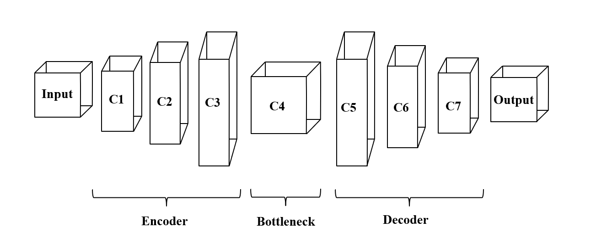

# ColorNet 🎨🖼️

ColorNet is a convolutional autoencoder-based model for **image colorization**, designed to automatically colorize grayscale images. It leverages deep learning techniques to restore color to black-and-white images, which is particularly useful for applications like historical photo restoration, digital archiving, and artistic enhancement.

## 🚀 Project Overview

This project aims to:

- Build a **convolutional autoencoder** model that learns to map grayscale images to their colorized versions.
- Use a dataset of AI-generated RGB images to train the model effectively.
- Evaluate the model's performance using **PSNR** and **SSIM** metrics.
- Deploy the model via a web application using **Next.js** (frontend) and **FastAPI** (backend).

## 🏗️ Model Architecture

The model consists of three major components:

1. **Encoder** – Compresses the input grayscale image while extracting essential features.
2. **Bottleneck** – Encodes the most important abstract representations of the input.
3. **Decoder** – Reconstructs the RGB image from the compressed features.

 <!-- Replace with the actual image path -->

## 📊 Evaluation Metrics

We used the following metrics to evaluate our model:

- **PSNR (Peak Signal-to-Noise Ratio)** – Measures signal fidelity.
- **SSIM (Structural Similarity Index Measure)** – Captures perceptual similarity.

Final results after training:

- **Loss**: 0.08%
- **PSNR**: 22.38 dB
- **SSIM**: 0.917

## 🌐 Web Application

The model is deployed in a web app where users can upload grayscale images and get them colorized in real-time.

- **Frontend**: Built with Next.js
- **Backend**: Powered by FastAPI

## 🧠 Team

- Tahir Abderrahmane El Mehdi  
- Rahmoun Wassim  
- Chaib Fakhreddine Fouzi  
- Annani Moncef

## 📂 Dataset

Used the [Stable ImageNet-1K dataset](https://www.kaggle.com/datasets/vitaliykinakh/stable-imagenet1k) from Kaggle (100k AI-generated RGB images).

---

